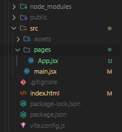

### O que é o ReactJS ?

Nada mais que uma biblioteca de JS com objetivo de criação de interfaces, por que chamamos de biblioteca e não framwork? Simples e por que ele não tem uma `opinião forte`, como estruturas de pastas, regras e etcs.

<br>

### Como criar um projeto React?
Para criarmos algum projeto React, podemos utilizar algumas estrategias como o <a href="https://vitejs.dev/guide/" target="_blank">Vite</a> , `Next`, `Gastby`, `Remix`, `Create React app`. OBS: a própria documentaação não recomenda o Create React App.

> Recentemente Houve uma mudança nas documentações que o proprio react, sugeri utilizar um frameworks como citado a cima.
>
>Uma grande observação que as novas versões do Next.js que a opção padrão de estilização dentros dos novos projetos Nexts esão voltadas agora ao Tailwind e não ao CSS models.

Caso queria ver mais sobre isso há um vídeo na Rocketseat, ou basta clicar <a href="https://www.youtube.com/watch?v=1ZDbOkW5ITs&t=622s" target="_blank">aqui</a>. No curso atualmente se utiliza o Vite.

Já para criar um projeto utilizano o Vite, e necessário utilizar a seguinte sintaxe:
```
npm create vite@latest nomeDoSeuProjeto --template react
```

<br>

### Como executar um projeto react?
Um dos motivos do Vite ser tão veloz e que ele não manda pasta node modules, assim independênte se criar um projeto novo ou baixar um e necessário rodar o comando abaixo para que ele baixe as dependências necessárias do projeto.
```
npm install
```

Após isso basta rodar o comando abaixo, e ele irá carregar o servidor do Node. 
```
npm run dev
```

para encerrar basta um dos dois comandos abaixo.
```
CTRL + C 

/// or

q
```

<br>

### Estrutura de um projeto React:
No React nos temos um arquivo `index.html`, que nele temos uma div com a classe de 'root' e um script passando um arquivo com a tag `jsx`

Quando for criado um novo porjeto utilizando o React, nos encontraremos a presença de alguns arquivos como `index.html` com uma classe "root" e um script passando um arquivo `.jsx` Além de uam pasta chamada `src`, aonde ficara uma pasta contendo a pasta pages, do react, pasta de assets e o `main.jsx`

> #### JSX, o que é ?
> E a sintaxe utilizada pelo React, e de forma bem resumida dentro de um arquivo .jsx, nos temos uma função com um retorno um conteúdo HTML.

#### Estrutura de páginas:
Na estrutura padrão do React nos temos dois arquivos responsáveis pelas dependências que são `package.json` e `package-lock.json`. Caso tenha alguma dúvida tenho um resumo sobre o Node, so clicar <a href="https://github.com/LFeli/Rocketseat-estudos-discovery-fundamentar/blob/main/17%20-%20NodeJS/module-04-summary.md" target="_blank">Aqui</a>. 

> Além disso temos o arquivo de configuração específico do Vite, nos não mexemos nele so deixamos ele **quietinho** no canto dele.

Pra fazer uma "instalação limpa" e praticamente limpar todos os arquivos e apenas manter a estrutura das pastas e os arquivos jsx, abaixo há um exemplo:




<br>

#### Fragment:
Um ponto interessante no JSX e que nós não podemos simplesmente ir adicionando elementos nos arquivos se um "wrapper", pois a função deve devolver apenas um único elemento.

No exemplo abaixo, o jsx retornaria um erro com duas possiveis soluções
```html
    <h1>Lista de presença</h1>
    <input type="text" placeholder="Digite seu nome...."/>
    <button type="button">Adicionar</button>
```

A primeira seriamos usamor o `fragment` que é nada mais um abre e fecha de tag:
```jsx
<>
    //Seu codigo bonito
</>
```

Outra maneira seria utilzarmos a boa e velha `div`, que praticamente irá dar na mesma.
```jsx
<div>
    //Seu codigo bonito
</div>
```

<br>

#### Import e exports de pages:
Há duas maneiras de fazer o import e export de uma pagina. A primeira e a maneira default que vem nos projetos.

```jsx
// Normalmente no arquivo main ficaria assim.
import Home from './pages/Home';
```

```jsx
// No arquivo que deseja exportar
function Home() {
  return (
    // seu codigo bonito
  )
}

export default Home
```

A segunda maneira seria feito deste modo:
```jsx
// Arquivo main.
import {Home} from './pages/Home';
```

```jsx
// No arquivo que deseja exportar
export function Home() {
  return (
    // seu codigo bonito
  )
}
```


<br>

### CSS:
E relativamente simples, entretanto antes iremos mexer na estrutura para se adequar em boas práticas. Inicialmente criamos uma pasta chamada `styles` dentro da "src" e colocamos o nome que quiser no arquivo.css.

Para adicionar no JSX, nos iremos utilizar a seguinte sintaxe:
```jsx
import './styles/seuArquivo.css';
```

<br>

##### Separando o CSS:
Uma forma de separar os arquivos CSS são deixarmos os arquivos de estilizações globais na pasta styles. O que for referente a própria página nos iremos utilizar a seguinte ideia.

Supomos que sua página se chame Home, você irá criar uma pasta chamada Home dentro da pasta "src" e dentro dela vc renomeara ou adiciar um arquivo com nome `index.jsx` e junto dele colocar um `style.css`.  
> (OBS: Neste caso em especifico não precisamos passar o nome do arquivo no caminho da importação, so até a pasta, pois como padrão quando não tiver um arquivo especifíco o jsx irá procurar o index)

Assim toda a estilização referente ao contéudo da index ficará por este style em especifico.

##### Estilizando o CSS:
Para estilizar o css via css_modules e exatamente igual ao html e css comum.

##### Importando fontes:
Para importarmos fontes e exatamente igual ao bom e velhor html, podemos passar no próprio `index.html` e utilizar o link para trazer a font, como podemos importar ele para nosso arquivo global e usar o `@import`. 

### Componentes:
O React ele trabalha muito com componentes e o primeiro passo para manter nossa organização na estrutura de pasta do projeto, nos iremos criar uma pasta chamada `components` dentro do 'src'.

Para chamarmos um componente, nos utilizamos a seguinte sintaxe:
```jsx
<Component />
```
OBS: o nome 'Component' e na vdd o nome que você põem na função no arquivo jsx.